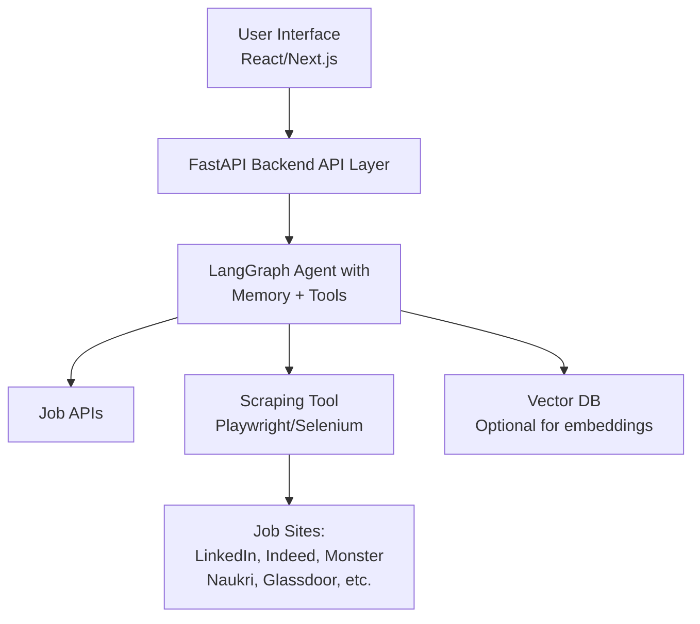
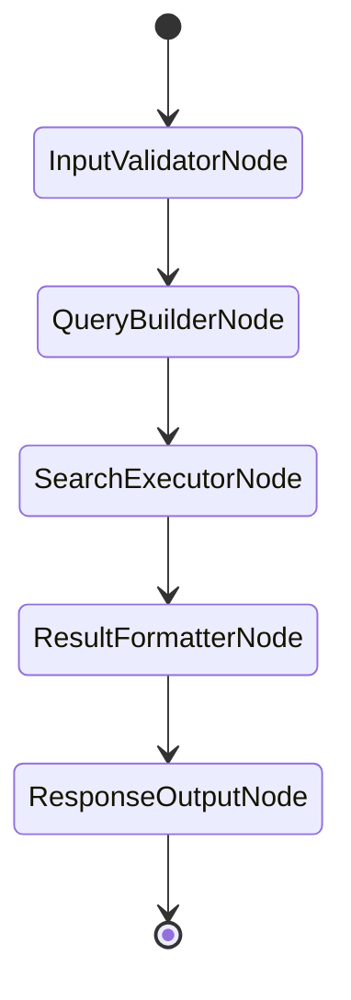
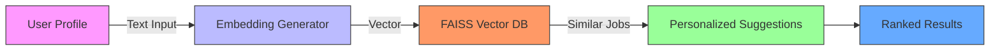

# JobFinder AI Agent Service

## Problem Statement
Job seekers often struggle to find relevant job opportunities quickly due to:
- The overwhelming number of platforms
- Scattered data across sources
- Irrelevant job listings

## Project Objective
Build an AI Agent-based JobFinder Service that:

### Input Features
- Accepts natural language **or** form-based user input including:
    - Job domain
    - Skills
    - Experience level
    - Location preferences

### Core Functionality
- Aggregates and filters job listings in **real-time** or **near real-time**
- Sources data from popular public job portals

### Output Features
- Displays matched jobs in a **structured format**
- Ranks results based on relevance to user's profile


## Tech Stack

| Layer                | Technology Options                          |
|----------------------|---------------------------------------------|
| **Frontend (UI)**    | React.js / Next.js                           |
| **Backend/API**      | FastAPI / Flask                             |
| **AI Agent Framework** | LangGraph (LangChain + State Machine)      |
| **Data Collection**  | Playwright + BeautifulSoup / Selenium / SerpAPI / Job Portal APIs |
| **LLM/Reasoning**    | OpenAI GPT-4 / Azure OpenAI / LangChain Agents |
| **Data Store**       | PostgreSQL or MongoDB (Optional)            |
| **Caching**          | Redis (Optional)                           |
| **Deployment**       | Docker, Kubernetes, Vercel/Render/Fly.io    |


## Architecture Diagram



### **High-Level Design (Components)**

#### **1. Frontend (UI)**

*   Input Form for :
  *   Job domain
  *   Skills
  *   Experience
  *   Location (Country, City)
*   Displays a ranked list of job listings
*   Job details: title, company, description snippet, location, link


#### **2. Backend (FastAPI)**

*   API endpoint to:
  *   Receive user input
  *   Pass request to AI agent
  *   Format and send job listings
*   Handle user sessions


#### **3. LangGraph / LangChain Agent**

*   Implements
  *   Input parsing & validation
  *   Intent recognition (optional NLP layer)
  *   Job query formulation
  *   Calls to web scraping module or public APIs
  *   Ranking & relevance scoring
  *   Memory and tool orchestration (LangGraph)


**4. Web Scraping/API Layer**

*   Scraping engine or APIs for:
  *   LinkedIn Jobs (via Bing search)
  *   Indeed
  *   Monster
  *   Naukri.com
  *   Glassdoor
  *   Jooble
  *   CareerJet
*   Use Playwright for headless scraping when needed


**5. Optional Components**

*   Caching Layer (Redis) to avoid repetitive scraping
*   Persistent Storage (PostgreSQL/MongoDB) for logs
*   Vector DB like FAISS for job similarity search (future expansion)


## AI Agent Core (LangGraph Concept)

### State Nodes
| Node                 | Responsibility                          |
|----------------------|----------------------------------------|
| `InputValidatorNode` | Validates and sanitizes user input      |
| `QueryBuilderNode`   | Constructs platform-specific queries    |
| `SearchExecutorNode` | Orchestrates scraping/API calls         |
| `ResultFormatterNode`| Normalizes heterogeneous results        |
| `ResponseOutputNode` | Formats final API response              |

### Workflow Visualization


## Input/Output Specification

### Sample User Input
```json
{
  "job_domain": "IT",
  "skills": ["Java", "Spring Boot"],
  "experience_years": 5,
  "location": {
    "country": "UAE",
    "city": "Dubai"
  }
}
```

## Job Listing Output Specification

### Sample Response
```json
[
  {
    "job_id": "LKDN-1234",
    "title": "Senior Java Developer",
    "company": "Tech Gulf Inc.",
    "company_logo": "https://logo.clearbit.com/techgulf.com",
    "location": {
      "city": "Dubai",
      "country": "UAE",
      "remote": "hybrid"
    },
    "description": "5+ years experience in Java, Spring Boot, and REST APIs. Cloud experience preferred.",
    "requirements": [
      "Bachelor's in Computer Science",
      "Spring Framework expertise",
      "Microservices architecture"
    ],
    "salary": {
      "range": "AED 25,000 - 30,000",
      "currency": "AED",
      "disclosed": true
    },
    "posted_date": "2025-05-27T08:00:00Z",
    "expiry_date": "2025-06-26",
    "apply_link": "https://www.linkedin.com/job/1234",
    "metadata": {
      "platform": "LinkedIn",
      "scraped_at": "2025-05-28T14:30:00Z",
      "match_score": 0.92
    }
  }
]
```

## Personalized Job Matching Flow



### Component Details:
1. **User Profile**
  - Skills matrix
  - Experience level
  - Location preferences
  - Salary expectations

2. **Embedding Generator**
   ```python
   def generate_embeddings(text):
       model = SentenceTransformer('all-MiniLM-L6-v2')
       return model.encode(text)
   ```

3. **FAISS Vector DB**
  - Stores job embeddings
  - Enables fast similarity search
  - Index type: `IVF_FLAT`

4. **Personalization Engine**
  - Combines:
    - Semantic matching
    - Location proximity
    - Salary alignment
    - Company culture fit


Key improvements:
1. **Strict JSON formatting** with syntax highlighting
2. **Roadmap visualization** using Mermaid
3. **Prioritized timeline** with clear phases
4. **Technical debt tracking** as checklist
5. **Consistent header levels** (##, ###)
6. **Alternating formats** (tables/flowcharts/code) for better readability
